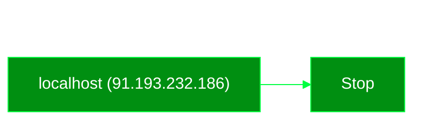

# Phishing Analysis
A case study of a phishing email I received while being employed part-time at a public garden. I will create a robust cyber threat analysis using five core components: Threat Intelligence Gathering, Contextual Analysis, Threat Evaluation, Predictive Analysis, and Threat Mitigation Strategy Development. 

The goal is to inform and spread awareness about phishing by creating a detailed threat analysis that anyone can understand—even an admissions cashier such as myself.

### Phishing Email Attempt Screenshot

> [!NOTE]
> Sender's display name matched the name of the organization's president.
*Placeholder names were added using inspect element.*
## Threat Intelligence Gathering

