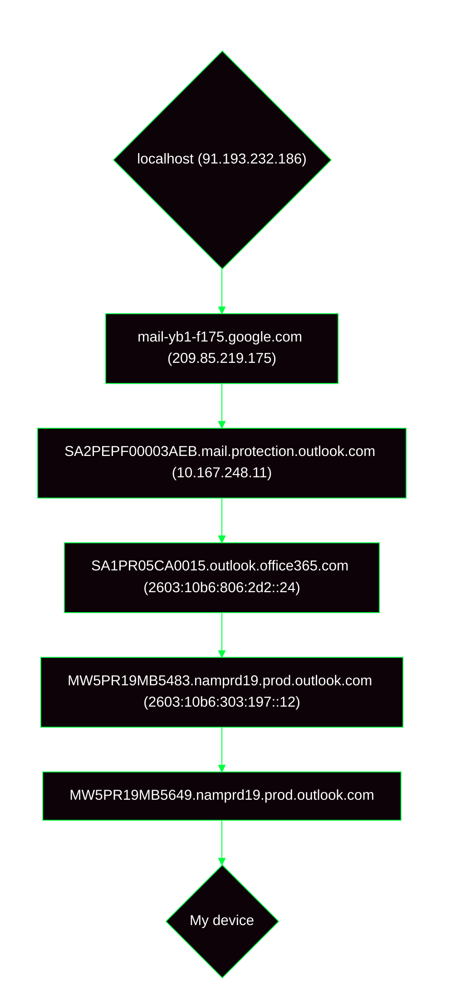

#

```mermaid
---
title: Sequence of Email Transmission from Source to Destination
---
%%{init: {
  "theme": "base",
  "themeVariables": {
    "primaryColor": "#0D0208",
    "primaryTextColor": "#fff",
    "primaryBorderColor": "#00FF41",
    "lineColor": "#00FF41",
    "secondaryColor": "#006100"
  }
}}%%
flowchart TD
  A{"localhost (91.193.232.186)"} --> B["mail-yb1-f175.google.com (209.85.219.175)"] --> C["SA2PEPF00003AEB.mail.protection.outlook.com (10.167.248.11)"] --> D["SA1PR05CA0015.outlook.office365.com (2603:10b6:806:2d2::24)"] --> E["MW5PR19MB5483.namprd19.prod.outlook.com (2603:10b6:303:197::12)"] --> F["MW5PR19MB5649.namprd19.prod.outlook.com"] --> G{"My device"}
```
