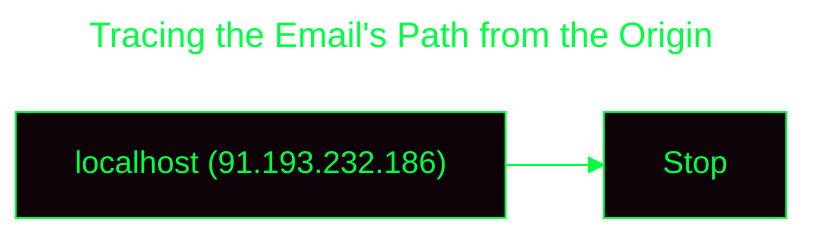

# Threat Intelligence Gathering

```mermaid
---
title: Tracing the Email's Path from the Origin
---
%%{init: {
  "theme": "base",
  "themeVariables": {
    "primaryColor": "#0D0208",
    "primaryTextColor": "#00ff41",
    "primaryBorderColor": "#00FF41",
    "lineColor": "#00FF41",
    "secondaryColor": "#006100"
  }
}}%%
flowchart LR
  A["localhost (91.193.232.186)"] --> B[Stop]
```
